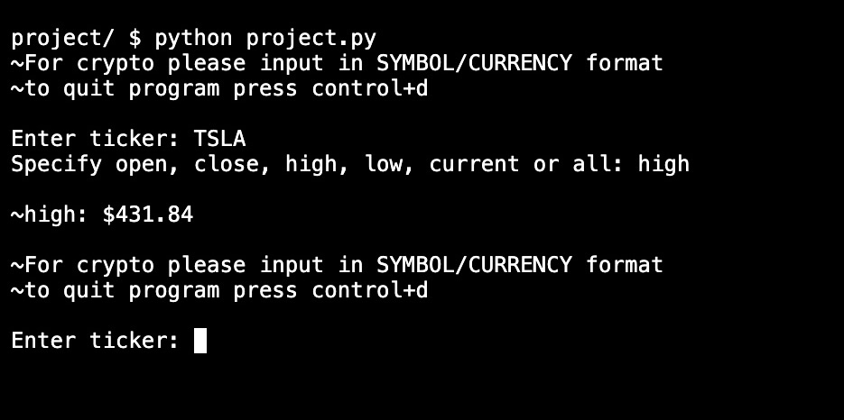
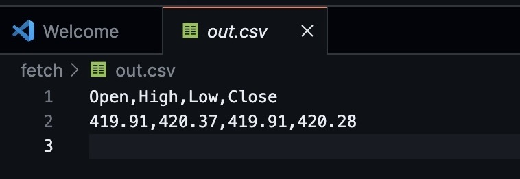
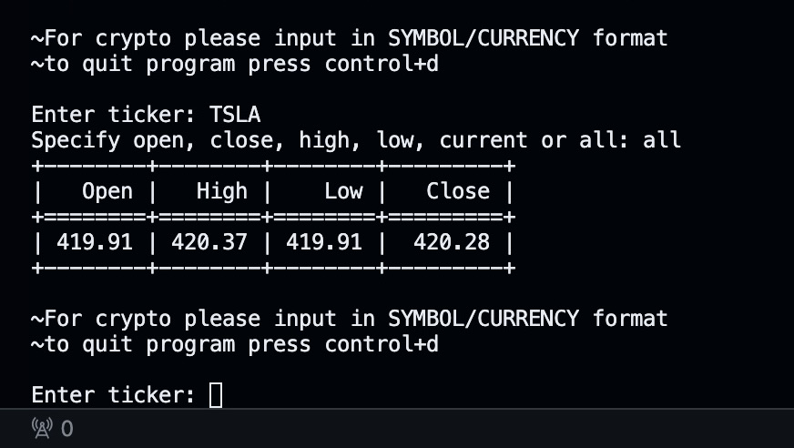

# Updated-CS50P-final-project
Revamping my final project!

## The project used to just print results to the terminal.

### _Screenshot of Program:_

    

## Implemented the csv & tabulate modules.
### Now the program writes the _bar info_ to a csv file and prints the info in a clean table grid to the terminal!

### _csv file:_

  

### _tabulate_output:_

  

